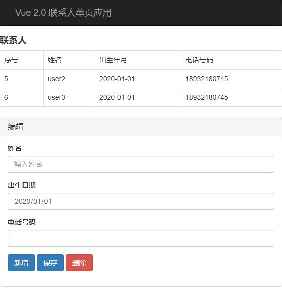
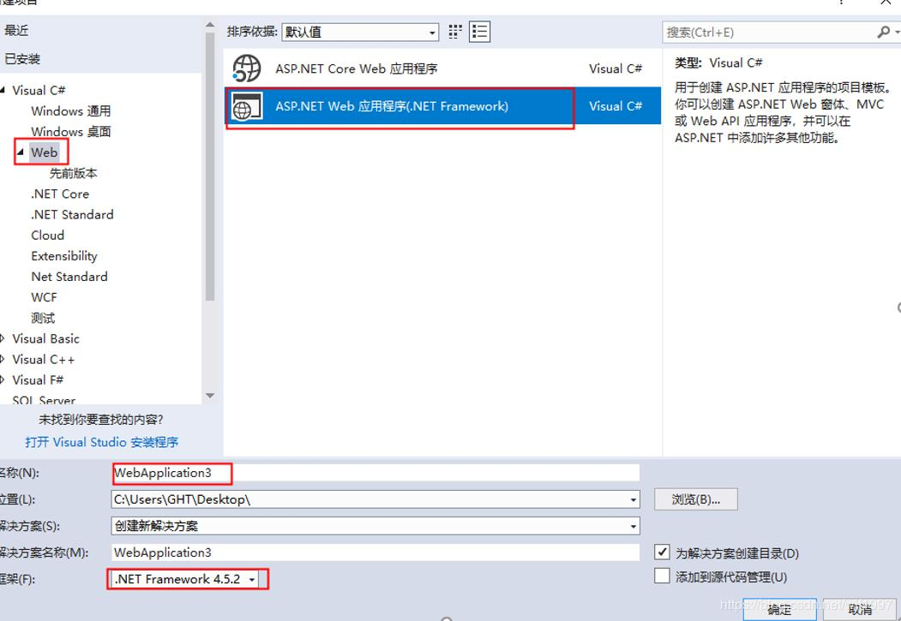
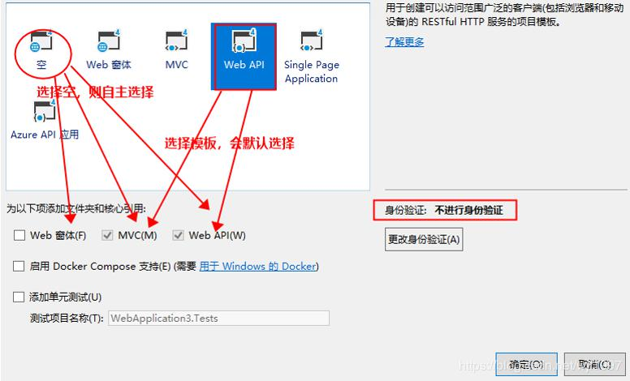
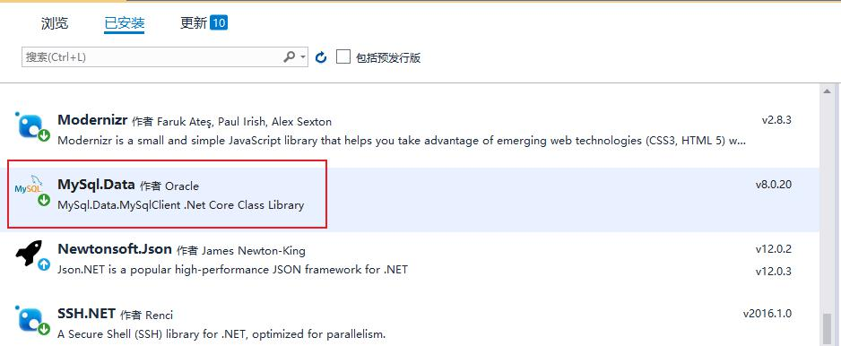
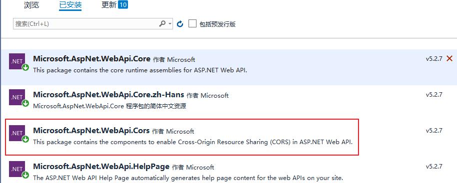
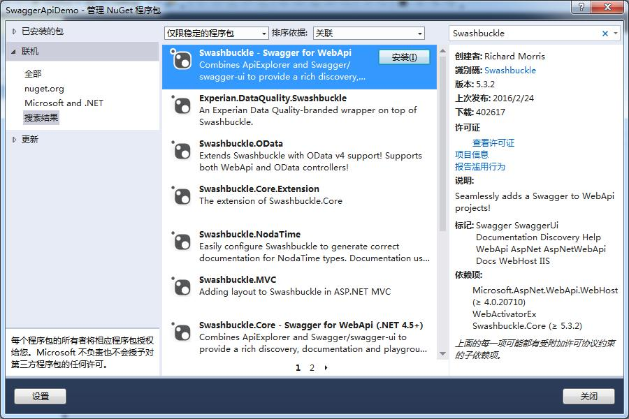
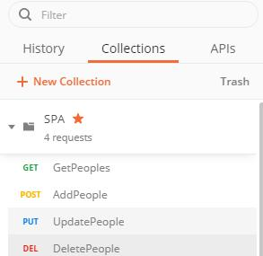
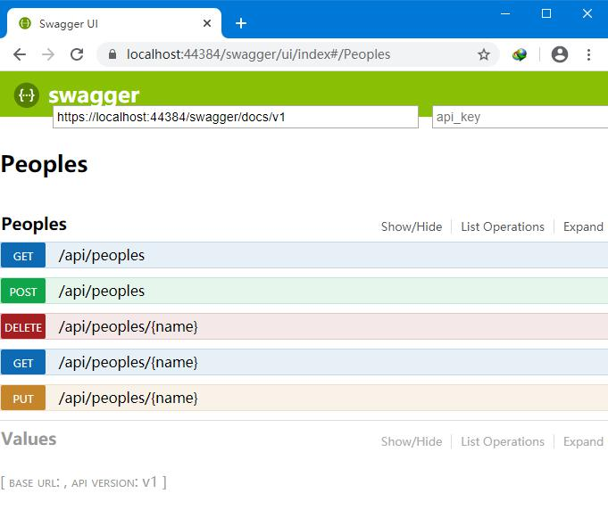

# ContactPerson
## :art: 介绍
联系人管理
## :rocket: 软件架构
Vue前端 + C# WebAPI + MySql
1. 前端选择单网页Vue，没有借助脚手架。
2. 后端选择C# 的WebAPI。
3. 数据库为MySql。

## :memo: 安装教程
### 1. 搭建前端
#### 1.1 创建静态的vue页面
预览界面

代码参考
```html
<!DOCTYPE html>
<html>
	<head>
		<meta charset="utf-8">
		<title></title>
		<link href="css/bootstrap.min.css" rel="stylesheet">
		<script src="js/bootstrap.min.js"></script>
		<script src="js/vue.js" type="text/javascript" charset="utf-8"></script>
	</head>
	<body>
		<div id="demo">
			<nav class="navbar navbar-inverse">
				<div class="container-fluid">
					<div class="navbar-brand">Vue 2.0 联系人单页应用</div>
				</div>
			</nav>
			<!-- 主页面 -->
			<div>
				<h4><b>联系人</b></h4>
			</div>
			<table class="table table-bordered table-hover">
				<thead>
					<tr>
						<td>序号</td>
						<td>姓名</td>
						<td>出生年月</td>
						<td>电话号码</td>
					</tr>
				</thead>
				<tbody>
					<tr v-for="item in list" :key="item.Id">
						<td>{{item.Id}}</td>
						<td>{{item.Name}}</td>
						<td>{{item.Birthday}}</td>
						<td>{{item.Telephone}}</td>
					</tr>
				</tbody>
			</table>
			<!-- 添加修改页面  -->
			<div id="editform" class="panel panel-default">
				<div class="panel-heading">
					<h3 class="panel-title">编辑</h3>
				</div>
				<div class="panel-body">
					<form class="form-horizontal" role="form" v-on:submit.prevent>
						<div class="form-group">
							<label class="col-sm-2 control-label">姓名</label>
							<div class="col-sm-10">
								<input class="form-control" v-model="row.Name" id="name" placeholder="输入姓名">
							</div>
						</div>
						<div class="form-group">
							<label class="col-sm-2 control-label">出生日期</label>
							<div class="col-sm-10">
								<input type="date" class="form-control" v-model="row.Birthday" id="birthday">
							</div>
						</div>
						<div class="form-group">
							<label class="col-sm-2 control-label">电话号码</label>
							<div class="col-sm-10">
								<input class="form-control" v-model="row.Telephone" id="phone">
							</div>
						</div>
						<div class="form-group">
							<div class="col-sm-offset-2 col-sm-10">
								<button @click="newrow" class="btn btn-primary">新增</button>
								<button @click="saverow" class="btn btn-primary">保存</button>
								<button @click="deleterow" class="btn btn-danger">删除</button>
							</div>
						</div>
					</form>
				</div>
			</div>

			<script>
				new Vue({
					el: "#demo",
					data: {
						row: {
							Id: 0,
							Name: "",
							Birthday: "2020-01-01",
							Telephone: ""
						},
						list: [{
								Id: 5,
								Name: "user2",
								Birthday: "2020-01-01",
								Telephone: "18932180745"
							},
							{
								Id: 6,
								Name: "user3",
								Birthday: "2020-01-01",
								Telephone: "18932180745"
							}
						]
					}
				})
			</script>
	</body>
</html>
```
#### 1.2 UI 是bootstrap
head中引入
```html
		<link href="css/bootstrap.min.css" rel="stylesheet">
		<script src="js/bootstrap.min.js"></script>
```
#### 1.3 第三方类库
head中引入
```html
		<script src="js/underscore.js"></script>
		<script type="text/javascript" src="https://unpkg.com/axios/dist/axios.min.js"></script>
		<script src="https://cdn.bootcdn.net/ajax/libs/qs/6.9.3/qs.min.js"></script>
```
> 为了运行速度和版本兼容，一些库保存到了本地，一般使用公共CDN即可，如[猫云CDN](https://www.bootcdn.cn/)。
- underscore 数组操作
- axios 请求post等action
- qs 转义
#### 1.4 从后端获取数据
1. 发送请求
使用axios发送restful请求，需要配合qs将body中的数据格式化。
2. json和类的转换。
因为编辑页面的信息和row绑定了，如果不做操作的话，点击新增会使选中行的数据也发生变化，
因为js中没有类的copy，可以将类转成json字符，再转成新的类，这样row 就跟选中行解绑了。
### 2. 搭建后端
#### 2.1 新建项目
1. 文件-->新建-->项目-->ASP.NET Web应用程序

2. 选择模板中的Web API模板（本例选择的webAPI 模板）

#### 2.2 Nuget引入MySql包

#### 2.3 在Models文件夹下创建model
```C#
	public class people
    {
        private int id;
        private string name;
        private string birthday;
        private string telephone;

        public int Id { get => id; set => id = value; }
        public string Name { get => name; set => name = value; }
        public string Birthday { get => birthday; set => birthday = value; }
        public string Telephone { get => telephone; set => telephone = value; }
    }
```

#### 2.4 在Controllers文件夹下创建controller
使用RESTful API接口设计：
查询 GET ：**GET** /peoples/{userId}
增加 POST：**POST** /peoples
修改 PUT：**PUT** /peoples/{userId} 即提供该用户的所有信息来修改
删除 DELETE：**DELETE** /peoples/{userId}
```C#
	public class PeoplesController : ApiController
    {
        private MySqlConnection GetConnection()
        {
            string connectString = "data source=106.53.98.143;database=fastlink;user id=root;password=admin;pooling=false;charset=utf8";//pooling代表是否使用连接池
            MySqlConnection conn = new MySqlConnection(connectString);
            conn.Open();
            return conn;
        }
        [Route("api/peoples")]
        // GET api/peoples
        public IEnumerable<people> Get()
        {
            List<people> list = new List<people>();
            using (MySqlConnection conn = this.GetConnection())
            {
                using (MySqlCommand com = new MySqlCommand())
                {
                    com.Connection = conn;
                    com.CommandText = "select * from peoples";
                    MySqlDataReader reader = com.ExecuteReader();
                    while (reader.Read())
                    {
                        people line = new people();
                        int id = 0;
                        int.TryParse(reader["id"].ToString(), out id);
                        line.Id = id;
                        line.Name = reader["name"].ToString();
                        DateTime dt = DateTime.MinValue;
                        DateTime.TryParse(reader["birthday"].ToString(), out dt);
                        line.Birthday = dt.ToString("yyyy-MM-dd");
                        line.Telephone = reader["telephone"].ToString();
                        list.Add(line);
                    }
                }
            }
            return list.ToArray();
        }
        [HttpGet]
        //注意：如果想通过Get请求AA/index/names，可以在Get前面加Route。
        [Route("api/peoples/{name}")]
        // GET api/peoples/zhangsan
        public people Get(string name)
        {
            people line = new people();
            using (MySqlConnection conn = this.GetConnection())
            {
                using (MySqlCommand com = new MySqlCommand())
                {
                    com.Connection = conn;
                    com.CommandText = "select * from peoples" + " where name=@name ";
                    com.Parameters.AddWithValue("@name", name);
                    MySqlDataReader reader = com.ExecuteReader();
                    if (reader.Read())
                    {

                        int id = 0;
                        int.TryParse(reader["id"].ToString(), out id);
                        line.Id = id;
                        line.Name = reader["name"].ToString();
                        DateTime dt = DateTime.MinValue;
                        DateTime.TryParse(reader["birthday"].ToString(), out dt);
                        line.Birthday = dt.ToString("yyyy-MM-dd");
                        line.Telephone = reader["telephone"].ToString();

                    }
                }
            }
            return line;
        }
        //create
        [HttpPost]
        [Route("api/peoples")]
        // POST: api/Users
        public void Post([FromBody]people line)
        {
            using (MySqlConnection conn = this.GetConnection())
            {
                using (MySqlCommand com = new MySqlCommand())
                {
                    com.Connection = conn;
                    com.CommandText = "insert into peoples(name, birthday, telephone) values (@name, @birthday, @telephone) ";
                    com.Parameters.AddWithValue("@name", line.Name);
                    com.Parameters.AddWithValue("@birthday", line.Birthday);
                    com.Parameters.AddWithValue("@telephone", line.Telephone);
                    com.ExecuteNonQuery();
                }
            }
        }

        [HttpPut]
        [Route("api/peoples/{name}")]
        // PUT: api/Users/5
        public void Put(string name, [FromBody]people line)
        {
            using (MySqlConnection conn = this.GetConnection())
            {
                using (MySqlCommand com = new MySqlCommand())
                {
                    com.Connection = conn;
                    com.CommandText = "update peoples set birthday=@birthday, telephone=@telephone where name=@name ";
                    com.Parameters.AddWithValue("@name", name);
                    com.Parameters.AddWithValue("@birthday", line.Birthday);
                    com.Parameters.AddWithValue("@telephone", line.Telephone);
                    com.ExecuteNonQuery();
                }
            }
        }

        [HttpDelete]
        [Route("api/peoples/{name}")]
        // DELETE: api/Users/5
        public void Delete(string name)
        {
            using (MySqlConnection conn = this.GetConnection())
            {
                using (MySqlCommand com = new MySqlCommand())
                {
                    com.Connection = conn;
                    com.CommandText = "delete from peoples where name=@name ";
                    com.Parameters.AddWithValue("@name", name);
                    com.ExecuteNonQuery();
                }
            }
        }
    }
```
#### 2.5 跨域
1. 使用nuget包获取Microsoft.AspNet.WebApi.Cors

2. 在App_Start\WebApiConfig.cs中加入代码
```C#
			//跨域配置
            config.EnableCors(new EnableCorsAttribute("*", "*", "*"));
```
#### 2.6 引入swagger
非必须，只是更好的管理接口，可跳过。使用nuget包获取Swashbuckle(swagger的包)并安装。


#### 2.7 Postman
用于调试后端接口

如图，已经导出SPA.postman_collection.json，见attachment文件夹。
### 3. MySql数据库
1. 新建数据库fastlink，字符集为utf8mb4
2. 执行sql语句，sql语句见附件文件夹。
```sql
CREATE TABLE `peoples` (
  `id` int(11) NOT NULL AUTO_INCREMENT,
  `name` varchar(50) DEFAULT NULL,
  `birthday` varchar(50) DEFAULT NULL,
  `telephone` varchar(50) DEFAULT NULL,
  PRIMARY KEY (`id`)
) ENGINE=MyISAM AUTO_INCREMENT=3 DEFAULT CHARSET=utf8mb4;
INSERT INTO `peoples` VALUES ('1', 'user51', '2020-01-01', '18932180745');
INSERT INTO `peoples` VALUES ('2', 'kevin', '2020-01-01', '18932180745');
```
### 4. 调试
1. 通过VS2019启动webAPI，浏览器会转向 链接https://localhost:44384 不同浏览器端口号可能不同。
增加/swagger 可以查看生效的APIs。

此时可以启动Postman进行接口调用测试。
2. 如果接口都正常，则通过浏览器打开index网页，测试增删改查功能。

至此，完成前后端分离的开发。


## :fire: 参与贡献

1.  Fork 本仓库
2.  新建 Feat_xxx 分支
3.  提交代码
4.  新建 Pull Request